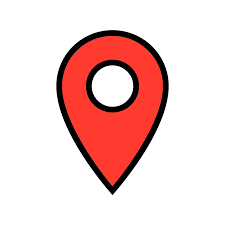

# Mapa OSM - Aplicação de Geolocalização com Flutter



## 📖 Visão Geral do Projeto

**Mapa OSM** é um aplicativo móvel multiplataforma, desenvolvido com o framework Flutter, que serve como uma solução completa para visualização e interação com mapas. Concebido como um projeto acadêmico, o aplicativo vai além de simplesmente exibir um mapa, incorporando funcionalidades de rastreamento em tempo real, busca por geocodificação e uma lógica inteligente para otimização do consumo de bateria.

A aplicação foi construída sobre a base de dados do [OpenStreetMap (OSM)](https://www.openstreetmap.org/), uma alternativa livre e de código aberto aos serviços de mapa comerciais, garantindo acesso a dados geográficos globais e atualizados pela comunidade.

---

## ✨ Funcionalidades Detalhadas

O projeto implementa um conjunto de funcionalidades essenciais para uma experiência de mapa moderna:

-   #### Geolocalização e Rastreamento em Tempo Real
    Utilizando o hardware de GPS do dispositivo, o aplicativo identifica a localização do usuário e a exibe com um marcador azul no mapa. A posição é atualizada continuamente através de um `Stream` de dados, garantindo que o marcador se mova de forma fluida conforme o usuário se desloca.

-   #### Busca por Endereços (Geocoding)
    Uma barra de busca flutuante permite ao usuário digitar um endereço textual. Ao submeter a busca, o aplicativo utiliza um serviço de geocodificação para converter o texto em coordenadas geográficas (latitude e longitude). O mapa então se centraliza automaticamente neste novo ponto, destacando-o com um marcador vermelho.

-   #### Otimização Inteligente de Bateria
    Uma das funcionalidades de destaque do projeto é a gestão consciente de energia. O aplicativo monitora o nível de bateria do dispositivo e ajusta dinamicamente a precisão solicitada ao serviço de GPS:
    * **Bateria Alta (>50%):** Precisão máxima (`LocationAccuracy.best`).
    * **Bateria Média (20-50%):** Precisão alta/média.
    * **Bateria Baixa (<20%):** Precisão baixa para economizar energia.
    Isso garante a melhor experiência possível sem esgotar a bateria do usuário desnecessariamente.

-   #### Gerenciamento de Permissões
    O aplicativo lida com o ciclo de vida das permissões de localização. Ele verifica se o serviço de GPS está ativo e se o app tem a permissão necessária. Caso contrário, ele guia o usuário com diálogos para solicitar a permissão, garantindo uma experiência de usuário sem interrupções.

-   #### Interface de Usuário Responsiva
    A interface foi construída para ser limpa e funcional. Um `Stack` de widgets permite sobrepor a barra de busca e indicadores de carregamento sobre o mapa sem interferir na visualização.

---

## 🏛️ Arquitetura e Design de Código

O projeto foi estruturado seguindo o padrão de arquitetura **MVVM (Model-View-ViewModel)** para garantir uma clara separação de responsabilidades, testabilidade e manutenibilidade do código.

-   **Model (`/models/location_model.dart`):** Representa a estrutura de dados da aplicação. Neste caso, a classe `LocationModel` define o que é uma localização (latitude e longitude).

-   **View (`/services/map_view.dart`):** A camada de interface do usuário (UI). É responsável por desenhar o mapa, os marcadores e a barra de busca. A View é "reativa", ou seja, ela apenas observa as mudanças no ViewModel e se redesenha conforme necessário, sem conter lógica de negócio.

-   **ViewModel (`/viewmodels/location_viewmodel.dart`):** O "cérebro" da aplicação. Ele orquestra a lógica de negócio, interage com os serviços (`LocationService`) e gerencia o estado da aplicação. Ele expõe os dados para a View e a notifica sobre quaisquer mudanças (nova localização, resultado de busca, erros) usando o `ChangeNotifier` do Flutter.

O `Provider` é o pacote escolhido para fazer a ponte entre o ViewModel e a View, gerenciando a injeção de dependências e a reconstrução dos widgets de forma eficiente.

---

## 🛠️ Tecnologias e Dependências Principais

-   **`flutter_map`**: Uma biblioteca versátil para integrar mapas de diversas fontes em um aplicativo Flutter. Foi escolhida por sua flexibilidade e compatibilidade com o OpenStreetMap.
-   **`geolocator`**: O pacote padrão da comunidade Flutter para interagir com os serviços de localização nativos do Android e iOS.
-   **`geocoding`**: A ferramenta utilizada para a geocodificação, transformando os endereços pesquisados em coordenadas.
-   **`provider`**: Um dos principais pacotes de gerenciamento de estado, que simplifica a propagação de estados pela árvore de widgets.
-   **`battery_plus`**: Fornece uma API simples para acessar informações sobre o status da bateria do dispositivo.
-   **`flutter_launcher_icons`**: Uma ferramenta de desenvolvimento essencial para automatizar a criação de ícones de aplicativo para múltiplas plataformas.

---

## 🚀 Como Executar o Projeto

Para executar este projeto, você precisará ter o **Flutter SDK** (versão 3.x ou superior) instalado e configurado em sua máquina.

1.  **Clone o repositório do projeto:**
    ```bash
    git clone <URL_DO_SEU_REPOSITORIO_AQUI>
    ```

2.  **Navegue para o diretório do projeto:**
    ```bash
    cd mapaosm
    ```

3.  **Instale todas as dependências necessárias:**
    ```bash
    flutter pub get
    ```

4.  **Execute o aplicativo em um emulador ou dispositivo físico:**
    ```bash
    flutter run
    ```

> **Nota de Configuração:** Para a funcionalidade de geocodificação funcionar corretamente, pode ser necessário configurar chaves de API para os serviços de geolocalização nativos, especialmente em produção. Para este projeto de desenvolvimento, a configuração padrão é suficiente.

---

## 🔮 Possíveis Melhorias Futuras

Embora o projeto cumpra todos os requisitos propostos, ele serve como uma excelente base para futuras expansões, como:

-   **Desenhar Rotas:** Implementar uma funcionalidade para traçar uma rota entre a localização do usuário e um ponto pesquisado.
-   **Salvar Locais Favoritos:** Permitir que o usuário salve marcadores de locais de interesse.
-   **Cluster de Marcadores:** Agrupar marcadores próximos em um único ponto quando o zoom do mapa está distante, melhorando a performance e a visualização.
-   **Diferentes Estilos de Mapa:** Adicionar uma opção para o usuário trocar o estilo do mapa (ex: satélite, noturno, etc.).

---

## 📄 Licença

Este projeto está distribuído sob a **Licença MIT**. Para mais detalhes, consulte o arquivo [LICENSE.md](license.md).

---

_Projeto desenvolvido por Marcos Eduardo Yashima Di Pardi._